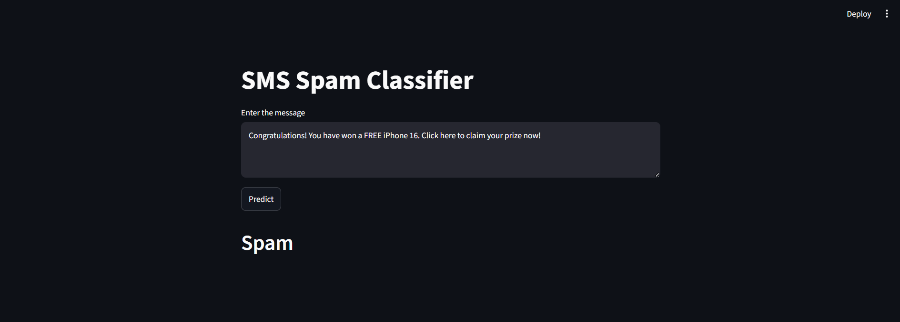
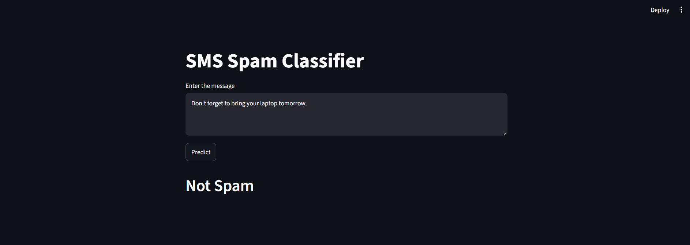

# 📩 SMS Spam Classifier

A Machine Learning web application built using **Python**, **Scikit-learn**, and **Streamlit** that classifies SMS messages as **Spam** or **Not Spam**.

---

## 🚀 Features

- Predicts whether an SMS is Spam or Not Spam
- Simple and interactive Streamlit interface
- Text preprocessing using NLTK
- TF-IDF Vectorization
- Trained Machine Learning classification model
- Instant predictions

---

## 🛠️ Tech Stack

- Python
- Streamlit
- Scikit-learn
- NLTK
- Pickle
- TF-IDF Vectorizer

---

## 📂 Project Structure

```
SMS-Spam-Classifier
│
├── app.py
├── model.pkl
├── vectorizer.pkl
├── SMS_Spam_Classifier.ipynb
├── README.md
│
└── screenshots
    ├── home.png
    └── prediction.png
```

---

## 📷 Application Screenshots

### Spam Prediction



---

### Not Spam Prediction



---

## ⚙️ Installation

Clone the repository

```bash
git clone https://github.com/YOUR_USERNAME/SMS-Spam-Classifier.git
```

Move into the project directory

```bash
cd SMS-Spam-Classifier
```

Create a virtual environment

### Windows

```bash
python -m venv venv
venv\Scripts\activate
```

### Linux/Mac

```bash
python3 -m venv venv
source venv/bin/activate
```

## ▶️ Run the Application

```bash
streamlit run app.py
```

The application will open in your browser.

---

## 🧠 Machine Learning Pipeline

1. Text Cleaning
2. Tokenization
3. Stopword Removal
4. Stemming using Porter Stemmer
5. TF-IDF Vectorization
6. Spam Prediction using the trained model

---

## 📌 Sample Messages

### Spam

```
Congratulations! You have won a FREE iPhone 16. Click here to claim your prize now!
```

Prediction:

```
Spam
```

### Not Spam

```
Hey, are we still meeting at 6 PM today?
```

Prediction:

```
Not Spam
```

---

## 📚 Future Improvements

- Deploy on Streamlit Cloud
- Display prediction probability
- Improve UI/UX
- Support multiple languages
- Add more classification models

---

## 👨‍💻 Author

**Tushar Krishna Biswas**

GitHub: https://github.com/Tushar0785
